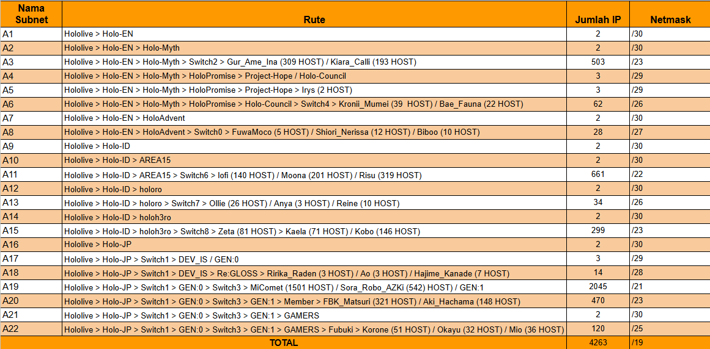
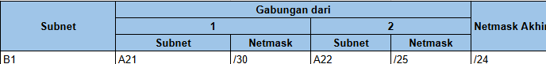
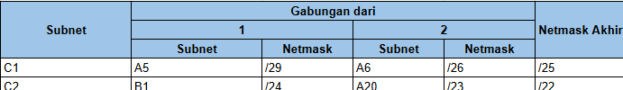
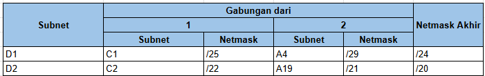
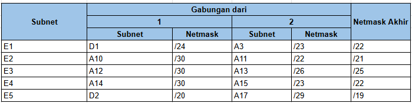
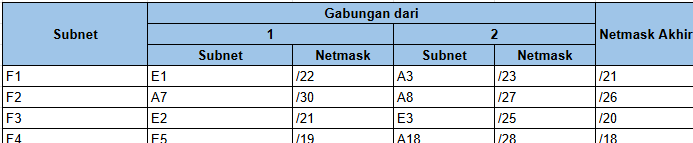
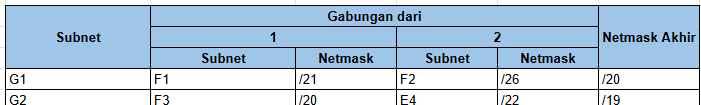
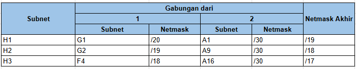
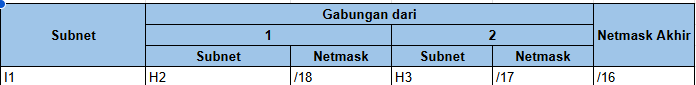
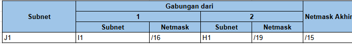

# LAPORAN RESMI MODUL 02 KOMUNIKASI DATA DAN JARINGAN KOMPUTER

## Jarkom-Modul-4-IT40-2024
Praktikum Jaringan Komputer Modul 4
Subnetting dan Routing

## Kelompok IT40

### Anggota Kelompok :

| Nama                          | NRP        |
| ----------------------------- | ---------- |
| Revalina Fairuzy Azhari Putri | 5027231001 |
| Kevin Anugerah Faza           | 5027231027 |

Menggunaan `CIDR` pada GNS3 dan `VLSM` pada Cisco Packet Tracer

#### Topologi GNS3

### Subnetting dan Pengelompokan
Berikut adalah pembagian rute dan subnetting yang telah dilakukan
- Pembagian Rute

- Pembagian Subnetting

- Pengelompokan 1

- Pengelompokan 2

.jpeg>)

- Pengelompokan 3

- Pengelompokan 4

.jpeg>)

- Pengelompokan 5

- Pengelompokan 6

.jpeg>)

- Pengelompokan 7

.jpeg>)

- Pengelompokan 8

- Pengelompokan 9

.jpeg>)

### Tree
Setelah dilakukan pengelompokan IP sebelumnya, kita akan melakukan pembagian IP menggunakan `tree` untuk kelompok yang telah dibagikan sebelumnya dengan hasil seperti berikut

### Pembagian IP
Berikut adalah hasil pembagian IP berdasarkan tree yang telah dibuat

## Konfigurasi Network pada GNS3